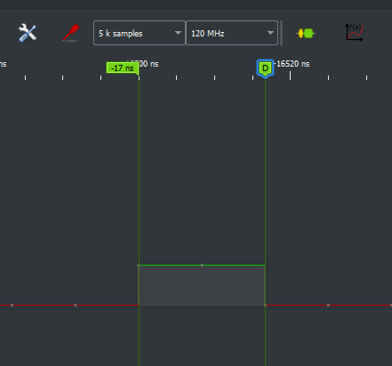
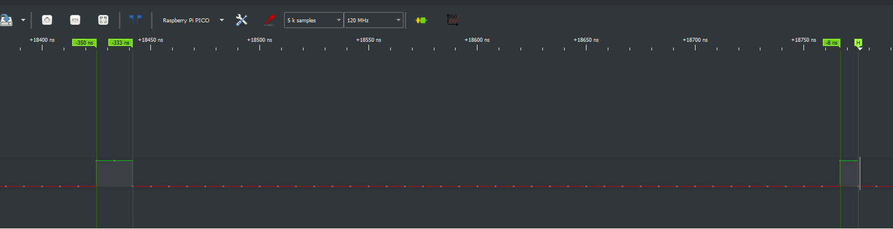

# 🔬 Logic Analyzer Test & Validation Report

**Device Name:** Azoteq Logic Analyzer
**Model / Variant:** 8 Digital + 2 Analog + 1 PWM
**Firmware / Software Version:** FW v1.0 / PulseView 0.4.2
**Date Tested:** 08/05/2026
**Engineer:** Ruben van Tonder

---

# ⏱️ Signal Generator Test

## Maximum Sampling Rate (Buffer)
- **Test Setup:**
  - Signal Source: Seesii DDS Signal Generator
  - Frequency Tested: 60MHz
  - Channels Used: 2 channels
  - Sample Rate: 200MSa/s

- **Procedure:**
  - Set CH1 to as high as possible frequency while a perfect square wave can be measured on the oscilloscope

- **Expected Behavior:**
  - Measure the specified signal on the oscilloscope without distortion

- **Observed Results:**
  - A Square wave of 2 MHz is the maximum frequency the signal generator can generate and be without significant distortion

- **Validation Outcome:** ⚠️
- **Notes:**
  - Note maximum 2MHz square/pulse waveforms should be used in the test

---

---

# ⏱️ Sampling & Frequency Tests

## Maximum Sampling Rate (Buffer)
- **Test Setup:**
  - Signal Source: Seesii DDS Signal Generator
  - Frequency Tested: 5MHz
  - Channels Used: 2 channels
  - Sample Rate: 120MSa/s

- **Procedure:**
  - Set CH1 to as high as possible frequency while a perfect square wave can be measured on the logic analyzer

- **Expected Behavior:**
  - Measure the specified signal on the logic analyzer without distortion

- **Observed Results:**
  -Observed stable 5MHz square wave when sampling at 100MHz. Distortion occures at higher frequency square waves but not due to sampling rate but due to signal generator rise/fall times
- **Validation Outcome:** ✅
- **Notes:**
  - Can succesfully measure up to 120MHz

---

## Minimum Detectable Pulse Width
- **Test Setup:**
  - Signal Generator: SeeSii 60MHz
  - Pulse Width Range: 200ns (5MHz)

- **Procedure:**
  - Set Signal geneator to 3.3V 5MHz with a starting duty cycle of 50%, gradually decrease duty cycle until signal no longer be sampling accurately. Then repeat the test by decrease the frequency at starting at 50% duty cycle again.

- **Expected Behavior:**
  - Measure the pulse width until it gets to small it start distorting or is missed by the logic analyzer

- **Observed Results:**
  - The logic analyzer is capable of measure up to a minimum pulse width of 17ns

- **Validation Outcome:** ✅
- **Notes:**
  - Pulse Width > 17ns reliable
  - Pulse Width < 17ns intermittent

  
  
---

# ⏱️ Timing Accuracy & Jitter

## Timing Accuracy (Edge-to-Edge Measurement)
- **Test Setup:**
  - Signal Source:
  - Sample Rate:
  - Channels Used:

- **Procedure:**
  -

- **Expected Behavior:**
  -

- **Observed Results:**
  - Expected Period:
  - Measured Period:
  - Error:

- **Validation Outcome:** ✅ / ⚠️ / ❌
- **Notes:**

---

## Jitter Measurement (Cycle-to-Cycle Variation)
- **Test Setup:**
  - Signal Source:
  - Sample Rate:

- **Procedure:**
  -

- **Expected Behavior:**
  -

- **Observed Results:**
  - Peak-to-Peak Jitter:
  - RMS Jitter:

- **Validation Outcome:** ✅ / ⚠️ / ❌
- **Notes:**

---

## Inter-Channel Timing Skew
- **Test Setup:**
  - Signal Source:
  - Channels Tested:

- **Procedure:**
  -

- **Expected Behavior:**
  -

- **Observed Results:**
  - Max Skew:

- **Validation Outcome:** ✅ / ⚠️ / ❌
- **Notes:**

---

# 💾 Storage & Data Mode Tests

## Hardware Storage Depth
- **Test Setup:**
  - Sample Rate:
  - Channels:
  - Memory Size:

- **Procedure:**
  -

- **Expected Calculation:**
- Capture Time = Total Bits / (Sample Rate × Channels)

-- **Observed Capture Duration:**
-

- **Validation Outcome:** ✅ / ⚠️ / ❌
- **Notes:**

---

## Stream Mode (Computer Memory)
- **Test Setup:**
- Sample Rate:
- Duration:
- Host PC Specs:

- **Procedure:**
-

- **Expected Behavior:**
-

- **Observed Results:**
- RAM Usage:
- Stability:
- Dropped Samples:

- **Validation Outcome:** ✅ / ⚠️ / ❌
- **Notes:**

---

# ⚡ Electrical & Signal Integrity

## Input Impedance
- **Test Setup:**
- Series Resistor:
- Signal Source:
- Measurement Tool:

- **Procedure:**
-

- **Expected Behavior:**
-

- **Observed Results:**
- Voltage Drop:

- **Validation Outcome:** ✅ / ⚠️ / ❌
- **Notes:**

---

## Adjustable Threshold
- **Test Setup:**
- Input Voltage:
- Threshold Levels:

- **Procedure:**
-

- **Expected Behavior:**
-

- **Observed Results:**
-

- **Validation Outcome:** ✅ / ⚠️ / ❌
- **Notes:**

---

# 📈 Analog Channel Tests

## Analog Sampling Accuracy
- **Test Setup:**
- Signal Source:
- Frequencies Tested:
- Voltages:
- Sample Rate:

- **Procedure:**
-

- **Expected Behavior:**
-

- **Observed Results:**
-

- **Validation Outcome:** ✅ / ⚠️ / ❌
- **Notes:**

---

## Analog Voltage Accuracy
- **Test Setup:**
- Input Voltages:

- **Procedure:**
-

- **Expected Behavior:**
-

- **Observed Results:**
- Measured vs Expected:

- **Validation Outcome:** ✅ / ⚠️ / ❌
- **Notes:**

---

## Analog-Digital Correlation
- **Test Setup:**
- Signal Type:
- Channels Used:

- **Procedure:**
-

- **Expected Behavior:**
-

- **Observed Results:**
-

- **Validation Outcome:** ✅ / ⚠️ / ❌
- **Notes:**

---

# 🔍 Protocol & Triggering

## Trigger Accuracy
- **Test Setup:**
- Trigger Type:
- Signal/Protocol:

- **Procedure:**
-

- **Expected Behavior:**
-

- **Observed Results:**
- Trigger Offset:
- Consistency:

- **Validation Outcome:** ✅ / ⚠️ / ❌
- **Notes:**

---

## Protocol Decoding
- **Test Setup:**
- Protocols Tested:
- Reference Device:

- **Procedure:**
-

- **Expected Behavior:**
-

- **Observed Results:**
-

- **Validation Outcome:** ✅ / ⚠️ / ❌
- **Notes:**

---

# 📊 Summary

| Category                  | Result |
|--------------------------|--------|
| Sampling & Frequency     |        |
| Timing & Jitter          |        |
| Storage & Data Modes     |        |
| Electrical Characteristics |      |
| Analog Performance       |        |
| Triggering & Protocol    |        |

**Overall Verdict:** ✅ PASS / ⚠️ PARTIAL / ❌ FAIL

---

# 📎 Additional Notes & Observations
-
-
-

---

# 📁 Attachments
- Waveform Screenshots:
- Logs:
- Raw Capture Files: